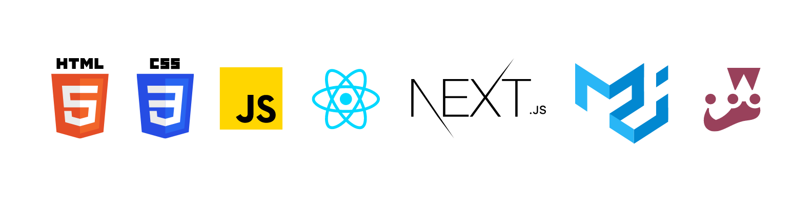

# Unosquare Center of excellence - Alejandra Sánchez

This repository contains JavaScript exercises done in the following courses. You can access to each course by clicking on its title.

------------

#### [Deep Javascript Foundations - Kyle Simpson](/Deep javascript v3/ "Deep Javascript Foundations - Kyle Simpson")
Core pillars of the JavaScript language: JavaScript's types, how to convert between them, lexical scope and closure and objects oriented system (this, prototypes and classes)

------------

#### [Javascript: from fundamentals to functional JS, v2 - Bianca Gandolfo](/JS Fundamentals to Functional/ "Javascript: from fundamentals to functional JS, v2 - Bianca Gandolfo")
A deep dive into JavaScript and functional programming techniques. High-order functions, closures, scope, functional methods, promises and ES6+.

------------

#### [React - The Complete Guide (incl Hooks, React Router, Redux) - Maximilian Schwarzmuller](/The React - Complete Guide/ "React - The Complete Guide (incl Hooks, React Router, Redux) - Maximilian Schwarzmuller")
React.js from scratch. Hooks, Redux, React Routing, Animations, Next.js.

------------

#### [ The complete guide to advanced React component patterns - Ohans Emmanuel](/Advanced Patterns/ " The complete guide to advanced React component patterns - Ohans Emmanuel")
React reusable components without relying on if statements or props, Use of hooks & trusted advanced patterns.

------------

#### [Testing React with jest and Testing Library - Bonnie Schulkin](/Testing with jest and Enzyme/ "Testing React with jest and Testing Library - Bonnie Schulkin")
Best practices for testing your apps with Jest and React Testing library.

------------

## Technology Stack:

